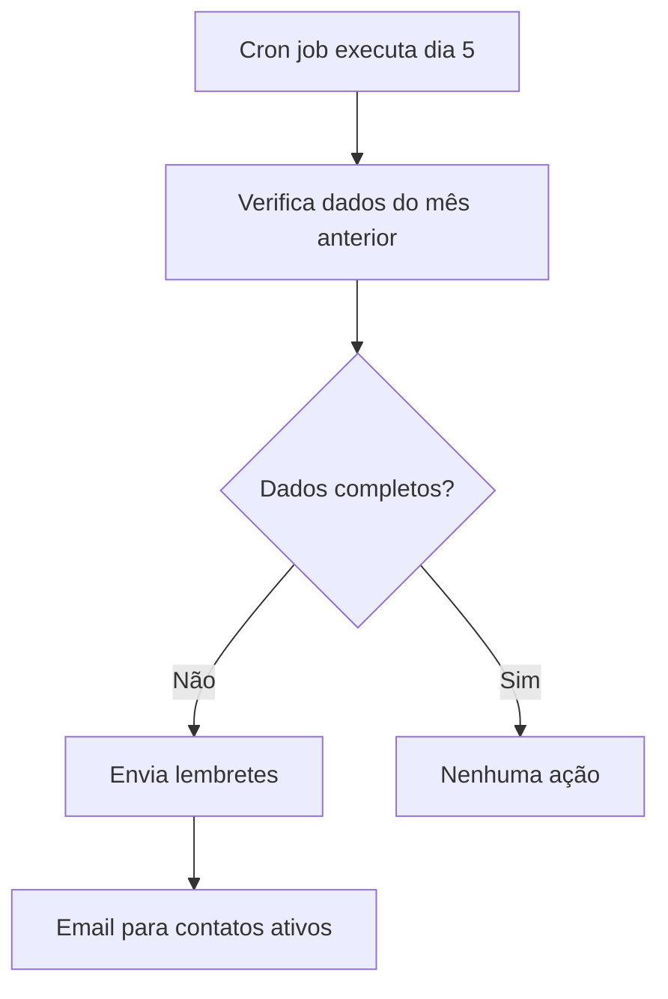

# Portal de Contabilidade Externa

Sistema para coleta automatizada de dados contábeis de escritórios de contabilidade externos.

## Visão Geral

O Portal de Contabilidade permite:
- Enviar convites por email para contadores externos
- Coletar dados de receita, folha de pagamento e impostos
- Agendar lembretes automáticos mensais
- Rastrear status de preenchimento

## Arquitetura

### Tabelas do Banco de Dados

| Tabela | Descrição |
|--------|-----------|
| `accounting_contacts` | Cadastro de contatos de contabilidade |
| `accounting_tokens` | Tokens de acesso únicos com expiração |
| `accounting_email_logs` | Histórico de emails enviados |

### Edge Functions

| Função | Descrição |
|--------|-----------|
| `send-accounting-link` | Envia email com link único para preenchimento |
| `save-accounting-data` | Recebe e salva os dados do formulário |
| `monthly-accounting-reminder` | Envia lembretes automáticos mensais |

### Componentes React

| Componente | Descrição |
|------------|-----------|
| `AccountingForm` | Formulário público para contadores |
| `useAccountingData` | Hook para gerenciamento de contatos e tokens |

## Fluxos de Trabalho

### 1. Envio de Convite Histórico

```mermaid
graph TD
    A[Admin seleciona contato] --> B[Clica em "Enviar Convite"]
    B --> C[Edge Function gera token]
    C --> D[Email enviado com link]
    D --> E[Contador acessa formulário]
    E --> F[Preenche dados históricos]
    F --> G[Dados salvos nas tabelas seed_*]
```

### 2. Lembrete Mensal Automático



## Como Usar

### Para Administradores

1. Acesse **Configurações → Dados 2025**
2. Localize o card **"Contabilidade Externa"**
3. Selecione ou crie um contato
4. Clique em **"Enviar Convite para Histórico"**
5. O contador receberá um email com link válido por 30 dias

### Para Contadores

1. Acesse o link recebido por email
2. Preencha os dados solicitados (receita, folha, impostos)
3. Revise os totais e o Fator R calculado
4. Clique em **"Enviar Dados"**

## Tipos de Convite

| Tipo | Período | Expiração |
|------|---------|-----------|
| `historico` | Nov/2024 a Dez/2025 | 30 dias |
| `mensal` | Mês anterior específico | 15 dias |

## Configuração do Cron

O lembrete mensal é executado via pg_cron:

```sql
-- Executa no dia 5 de cada mês às 11:00 UTC (08:00 BRT)
SELECT cron.schedule(
  'monthly-accounting-reminder',
  '0 11 5 * *',
  $$SELECT net.http_post(...)$$
);
```

## Segurança

- Tokens são únicos e criptograficamente seguros
- Expiração automática após período definido
- Tokens são marcados como usados após primeiro envio
- Não requer autenticação (acesso via token)
- RLS policies protegem dados internos

## Troubleshooting

### Email não chegou
1. Verifique se o email está correto no cadastro
2. Consulte o histórico em `accounting_email_logs`
3. Verifique se a chave RESEND_API_KEY está configurada

### Token expirado
- Envie um novo convite para o mesmo contato
- Tokens expirados não podem ser renovados

### Dados não aparecem
1. Verifique se o contador clicou em "Enviar Dados"
2. Consulte as tabelas `seed_revenue`, `seed_payroll`, `seed_taxes`
3. Verifique logs da edge function `save-accounting-data`

## Variáveis de Ambiente Necessárias

| Variável | Descrição |
|----------|-----------|
| `RESEND_API_KEY` | Chave da API Resend para envio de emails |
| `SUPABASE_URL` | URL do projeto Supabase |
| `SUPABASE_ANON_KEY` | Chave anônima do Supabase |
| `SUPABASE_SERVICE_ROLE_KEY` | Chave de serviço (para edge functions) |
